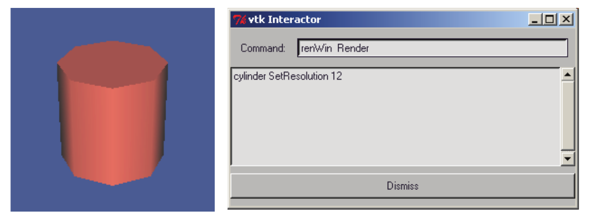
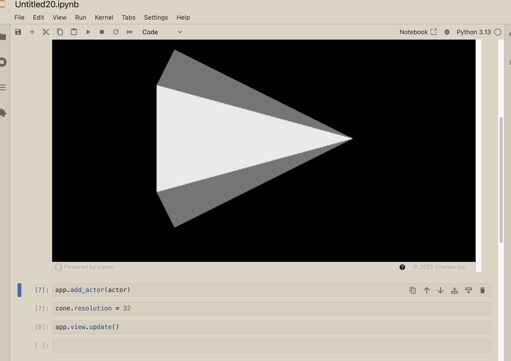

In a previous blog, I promised to cover modern ways of quickly developing user interfaces for prototyping. When I was a junior VTK developer, one of my favorite tools was this:



This nameless application enabled the user to type VTK code in the text editor and immediately see the results in the render window on the left. Many of us still like this kind of data exploration be it in an interactive Python shell or Jupyter. The problem with VTK and those approaches is that to interact with the render window, you have to start the interactor with something like `iren->Start()` at which point you can no longer type. You have to stop the interactor, type some more, and the restart the interactor. So how do we achieve this? Of course, you can use ParaView or write a full blown application that manages a prompt and the interactor in the same event loop (like ParaView 😄). OR you can use [trame](https://kitware.github.io/trame/) in Jupyter. Here is the small module that I wrote to do this:

```python
from trame.app import TrameApp  # Base class for a trame app
from trame.ui.vuetify3 import SinglePageLayout  # UI layout
from trame.widgets import vuetify3 as v3, vtk as vtk_widgets  # UI widgets

# VTK factory initialization
from vtkmodules.vtkInteractionStyle import vtkInteractorStyleSwitch  # noqa
import vtkmodules.vtkRenderingOpenGL2  # noqa

from vtkmodules import vtkRenderingCore as rendering_core

class Viewer(TrameApp):
    def __init__(self):
        super().__init__(None)  # enable self.server, self.state, self.ctrl

        self._renderer = rendering_core.vtkRenderer()
        self._renwin = rendering_core.vtkRenderWindow()
        self._renwin.SetOffScreenRendering(1)
        self._renwin.AddRenderer(self._renderer)
        self._interactor = rendering_core.vtkRenderWindowInteractor()
        self._interactor.SetRenderWindow(self._renwin)
        self._interactor.GetInteractorStyle().SetCurrentStyleToTrackballCamera()

        self._build_ui()

    def add_actor(self, actor):
        self._renderer.AddActor(actor)
        self.view.reset_camera()

    def _build_ui(self):
        with VAppLayout(self.server) as self.ui:
            self.view = vtk_widgets.VtkRemoteView(
                self._renwin,
                interactive_ratio=1,
                interactive_quality=100,
            )
```
And in Jupyter, here is what I do (let's call the module `vtk_view`).

```python
import vtk_view
from trame.app.jupyter_css import fullscreen

from vtkmodules import vtkRenderingCore as rendering_core
from vtkmodules import vtkFiltersSources as sources

cone = sources.vtkConeSource()
mapper = rendering_core.vtkPolyDataMapper()
cone >> mapper
actor = rendering_core.vtkActor()
actor.SetMapper(mapper)

app=vtk_view.Viewer()

app.add_actor(actor)
fullscreen(app)

cone.resolution = 32
app.view.update()
```

This gives me something like this.



I can now interactively explore VTK to my heart's content. I can even separate that window as a separate window so that it doesn't scroll up as I type (using Jupyter Lab). This is the simple VTK application that one can write with trame and yet it is very powerful. Most of the code is self explanatory to those who have seen a cone example. This is the bit that is trame:

```python
# Inherit from TrameApp for bunch of magic
class Viewer(TrameApp):
    ...
    def _generate_ui(self):
    # See trame doc for detail explanation but essentially
    # we create a single page web app here.
        with SinglePageLayout(self.server) as layout:
            layout.title.set_text("Trame demo")

            # We start inserting stuff inside the content section
            # of the app.
            with layout.content:
                # We create a Vue3 VContainer
                # https://vuetifyjs.com/en/api/v-container/
                with v3.VContainer(fluid=True, classes="pa-0 fill-height"):
                    # We insert a VtkRemoteView inside the VContainer.
                    # On the server side (yes there is a server running VTK
                    # code. This runs inside the Jupyter event loop sharing
                    # the same Python), this holds a vtkRenderWindow. On the
                    # client side, there is Javascript thing-a-magicky that
                    # renders images that it receives from the server. The
                    # interactive options manage this.
                    # https://github.com/Kitware/trame-vtk
                    self.view = vtk_widgets.VtkRemoteView(
                        self._renwin,
                        interactive_ratio=1,
                        interactive_quality=100)

            return layout
```

The other magic part here is the line that just says `app`. This is the line that causes Jupyter to render the trame content. I kinda know how it works but not enough to comfortably explain it.

By the way, those with sharp attention may have noticed one thing that is not C++-like that I sneaked into the example:

```python
cone >> mapper
```

This is sneak preview for my next blog where I start talking about pythonic VTK features that we keep introducing.
