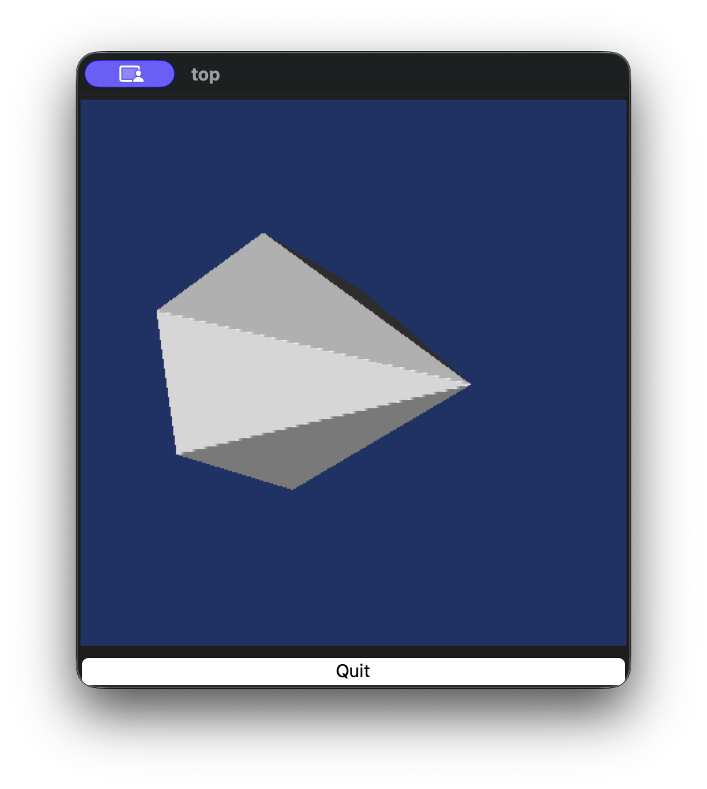
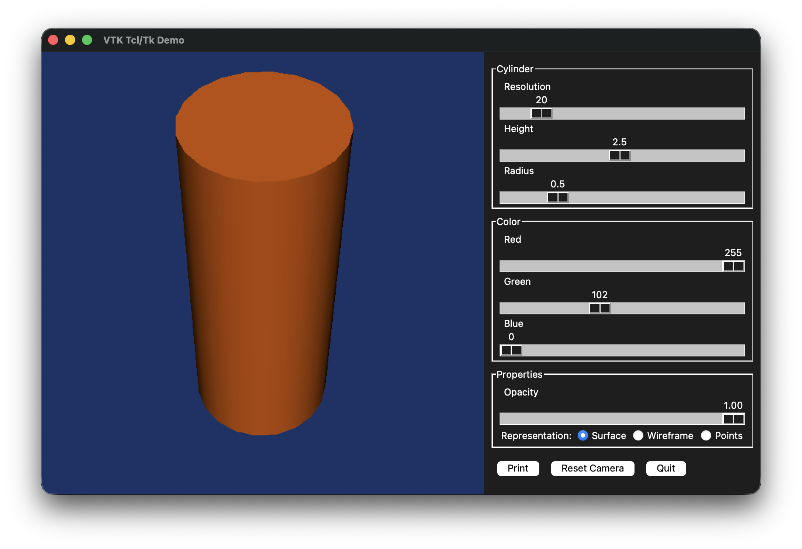
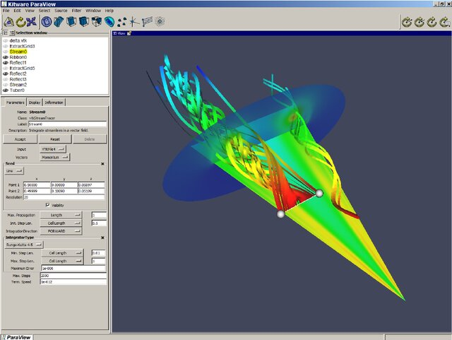

# VTK + Tcl/Tk: The Return

Is this code familiar?

```tcl
# Create the GUI: a render widget and a quit button
wm withdraw .
toplevel .top
frame .top.f1
vtkTkRenderWidget .top.f1.r1 -width 400 -height 400
button .top.btn -text Quit -command exit
pack .top.f1.r1 -side left -padx 3 -pady 3 -fill both -expand t
pack .top.f1 -fill both -expand t
pack .top.btn -fill x
```

How about this?

```cpp
  if (this->PreviousButton && this->PreviousButton->IsCreated())
    {
    this->Script(
      "pack %s -side %s -expand y -fill both -padx %d -pady %d",
      this->PreviousButton->GetWidgetName(), prev,
      this->ButtonsPadX, this->ButtonsPadY);
    }
  if (this->NextButton && this->NextButton->IsCreated())
    {
    this->Script(
      "pack %s -side %s -expand y -fill both -padx %d -pady %d",
      this->NextButton->GetWidgetName(), next,
      this->ButtonsPadX, this->ButtonsPadY);
    }
```

If either of these are familiar to you, you are among a small group of a people who had the pleasure of programming using Tcl/Tk. The first example is from VTK 5.4 (vtkTkRenderWidgetDemo.tcl). We'll discover where the second example is from later.

I was recently writing a blog on VTK in 10 different languages. I started by talking about VTK's original Tcl bindings but I could not run any of the examples due to lack of Tcl support in modern VTK. I kept going and when I came to Julia (which I am a big fan of), I found out that its Python interop is very advanced and the integration makes it feel almost native. Similarly with Ruby. So, I asked my intern Claude if there was anything similar for Tcl. It came up with this project: [libtclpy](https://github.com/aidanhs/libtclpy). Amazing!!! It didn't do what I wanted out of box but with help from the dedicated intern, I was able to come up with something that look eerily similar to VTK's Tcl bindings. The following works:

```tcl
source vtktcl.tcl

# Classic VTK Tcl pipeline - just like the old days

set resolution 50

vtkCylinderSource cylinder
cylinder SetResolution $resolution
cylinder SetHeight 2.5
cylinder SetRadius 0.5

vtkPolyDataMapper mapper
mapper SetInputConnection [cylinder GetOutputPort]

vtkActor actor
actor SetMapper mapper

vtkRenderer ren
vtkRenderWindow renWin
renWin AddRenderer ren

vtkRenderWindowInteractor iren
iren SetRenderWindow renWin

ren AddActor actor
ren SetBackground 0.1 0.2 0.4
renWin SetSize 600 600

puts "Starting VTK render loop from Tcl..."
iren Initialize
renWin Render
iren Start
```

The only difference is that the original script would have started with `package require vtk` rather than the `source` statement. Tcl bindings were really cool. `vtkActor actor` actually created a command called `actor` that was bound to the VTK's object. Not object oriented but object oriented light. Ken Martin's ingenious design.

Pure Tcl VTK is only part of the picture though. What made Tcl/Tk the ultimate prototyping platform is the interaction of Tcl with Tk. Tk is essentially a graphics library programmed in Tcl. It was so quick to create an application with Tcl/Tk that we create prototype user interfaces for almost everything from debugging to demonstration.

So I really wanted to get Tk working with VTK. With some more help from AI, I added vtkTkRenderWidget emulation to vtk.tcl. So the example that I quoted above now works with minor changes now and looks like this:

```tcl
source vtktcl.tcl
package require Tk

# This script uses a vtkTkRenderWidget to create a
# Tk widget that is associated with a vtkRenderWindow

wm withdraw .
# Create the GUI: a render widget and a quit button
toplevel .top
frame .top.f1
vtkTkRenderWidget .top.f1.r1 -width 400 -height 400
button .top.btn -text Quit -command exit
pack .top.f1.r1 -side left -padx 3 -pady 3 -fill both -expand t
pack .top.f1 -fill both -expand t
pack .top.btn -fill x

# Get the render window associated with the widget
set renWin [.top.f1.r1 GetRenderWindow]
vtkRenderer ren1
$renWin AddRenderer ren1

# create a Cone source and actor
vtkConeSource cone
vtkPolyDataMapper coneMapper
  coneMapper SetInputConnection [cone GetOutputPort]
#  coneMapper GlobalImmediateModeRenderingOn
vtkLODActor coneActor
  coneActor SetMapper coneMapper

# Add the actor to the renderer and set the background
ren1 AddViewProp coneActor
ren1 SetBackground 0.1 0.2 0.4
[ren1 GetActiveCamera] Zoom 0.6
```

So now when I run the script above, I get this:



With a few more lines, something like this:



With a *few* more lines, one can achieve something like this:



This looks familiar? It is ParaView v2.6. If you wanted develop serious cross-platform applications in 1998, Tk was one of the few players in town. Qt was distributed under a dual license that was not compatible with the Kitware's philosophy of permissive licensing. Qt's free edition could not be used for commercial software. Even Python shipped with Tk then. The problem was that Kitware wanted to develop ParaView (and VolView) in C++. Solution? Wrap Tcl/Tk in C++. So ParaView had this crazy design where C++ called to Tcl/Tk for UI and for managing the state of VTK pipelines. That Tcl then called back to C++. As you can imagine, it was fun to debug. But we digress. The moral of the story is that Tcl/Tk was a solid platform for application development, be it for prototyping or full-blown end-user applications. We loved it and got a lot mileage out of it for years.

If consider yourself a code archeologist like me, you can find the source code for this experiment in these two repositories.

* [libtclpy fork](https://github.com/berkgeveci/libtclpy)
* [vtk_tcl](https://github.com/berkgeveci/vtk_tcl)

In future blogs, I will cover modern platforms to achieve similar results. I will cover trame, which is what I consider a much more functional platform with a similar approach and Dear ImGui which I am starting to use for prototyping.
